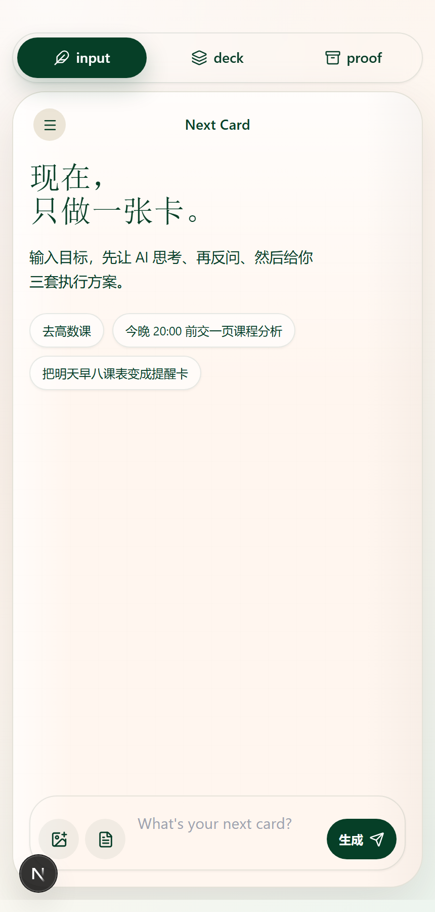
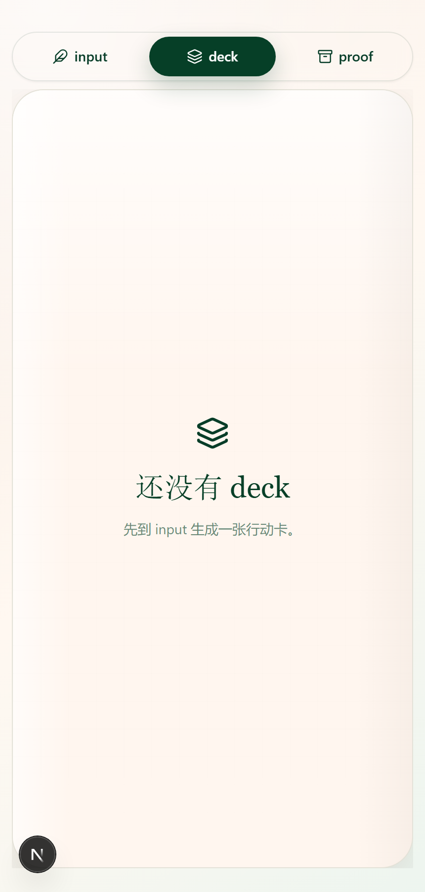
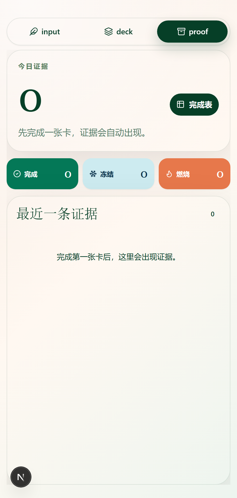

<div align="center">

# Next Card

**Turn vague goals into a swipeable card deck — and into visible evidence of action.**

[](https://next-card11-marioaxe690-afk.vercel.app)
[](https://nextjs.org/)
[](https://www.typescriptlang.org/)
[](https://tailwindcss.com/)
[](https://github.com/pmndrs/zustand)
[](./LICENSE)

**🚀 [Live Demo](https://next-card11-marioaxe690-afk.vercel.app)** · [中文](./README.md) · [Architecture](./docs/ARCHITECTURE.md) · [Product Spec](./docs/PRD.md)

> Best viewed on mobile, or with browser DevTools mobile emulation (~430px wide) — this is built for a single-column WebView.

</div>

---

## Where this came from

I'm a freshman majoring in Business Administration. Since the day I started college, I've been fighting one problem — **I can't get started on things.**

- A 3,000-word reading reflection? Just seeing "3,000 words" freezes me.
- "Read Chapter 1 of *Principles of Management* and make a mind map" — in my head it becomes a mountain, and I lie in bed scrolling my phone instead.
- Sometimes I have a clean 3-hour window and somehow nothing gets done.

It took me a while to realize it isn't laziness. It's that **tasks get described too big, too abstract, with no "next move."** "Read Chapter 1" is really 50 micro-actions in disguise, but nobody breaks them down for me, and I don't know which one to do first.

Todo apps don't fix this — they take "Read Chapter 1" verbatim and slap a red exclamation mark on it to make me feel worse.

So I used [Codex](https://openai.com/codex), [Claude Code](https://www.anthropic.com/claude-code), and ChatGPT — vibe-coding my way through — to build Next Card:

- **AI decomposes goals into next-actions** — not "Read Chapter 1," but "Open the book, turn to page 1, read for 10 minutes."
- **Cards visualize time pressure as burning/freezing** — guidance, not shame.
- **Every action writes to proof** — you can actually see what you did today, instead of one more line crossed out.

---

## What is this

Next Card is **not another todo app**. It targets a specific person: someone with a thing they *want* to do but can't get started on — a paper deadline, a class they're about to miss, a vague "I should push on this today."

You write one sentence. AI returns three plans, each already broken down into next-action steps. You pick one, and the tasks turn into a swipeable deck. Cards display **burning, freezing, or cracking** visuals to convey time pressure — instead of using red exclamation marks to make you feel guilty. Every action — completed, frozen, burned, rescheduled — is **written into proof as visible evidence**.

> *"Today you completed 2 stage goals. 1 card was finished in 6 minutes via quick-burn mode for a minimum viable result. 1 card was frozen — context preserved, suitable to resume tomorrow."*

That's what proof tells you after each session. **Not XP, not streaks, not badges — turning behavior into a readable story.**

---

## Three modes

<table>
<tr>
<td width="33%" align="center"><b>input</b><br/>ChatGPT-style composer<br/>AI generates 3 plans via Plan Mode</td>
<td width="33%" align="center"><b>deck</b><br/>Reigns-style single-card surface<br/>Swipe / double-click / triple-click / pull-to-freeze</td>
<td width="33%" align="center"><b>proof</b><br/>Colored table + charts + journal<br/>AI-summarized evidence of action</td>
</tr>
<tr>
<td></td>
<td></td>
<td></td>
</tr>
</table>

> Screenshots from local demo, generated entirely with the local mock AI — reproducible without any API key.

---

## Why not just another todo

| Todo apps | Next Card |
|---|---|
| You add "Study calculus" — but you still don't move | AI decomposes goals into next-action steps like *"Open the assignment, circle the 3 required submission points"* |
| Red deadlines + unfinished count = guilt machine | Time pressure becomes **burning / freezing / cracking** card visuals — guidance, not shame |
| Done = checkmark. No accumulation. | Each action writes to proof. **Behavior becomes visible evidence**, not a struck-through line. |
| Stuck cards just rot | **Freezing** preserves context. When the timer fires, AI re-analyzes: resume / split / keep waiting |

---

## Engineering Highlights

> Want a code map directly? See [Architecture](./docs/ARCHITECTURE.md).

### Two-Agent architecture

Not a single monolithic LLM call. Two agents with clean responsibilities:

- **Agent 1 — Clarify & Plan** (`lib/server/plan-mode-service.ts`): Four-phase state machine `thinking → asking → generating → ready`. Front and back ends share `CLARIFICATION_TURN_BUDGET = 5`, **forcing convergence — no infinite re-asking allowed.**
- **Agent 2 — Schedule & Push** (`lib/server/schedule-planner.ts` + `priority-engine.ts`): Produces `QueueAction[]`, gated by runtime guard before dispatch.

The boundary is a typed protocol — `lib/types.ts` is the contract layer.

### Provider Cascade (graceful degradation)

```
NEXT_CARD_CHAT_PROVIDER → DeepSeek → Mimo → Local Mock
```

The full flow runs without any API key — `lib/mock-ai.ts` is a **complete, deterministic fallback**. The UI is guaranteed to receive 3 plans. Clone, `pnpm dev`, and you have a fully working demo with zero env config.

### Runtime Guard (declarative config → runtime enforcement)

`lib/server/agent-runtime.ts` isn't documentation — it's **runtime enforcement**. A registry of 16 skills × 6 triggers, with `applyAgentRuntimeGuard()` acting as a gatekeeper using each trigger's action allowlist:

```ts
// worker-tick CANNOT accidentally produce reveal-hidden-goal
// Even if a code bug tries, the guard catches it,
// flags requiresUserReview = true,
// and provider-dispatch skips it.
```

### Preview / Dispatch two-phase commit

`/api/backend/worker/tick` defaults to `persist: false, dispatch: false` — **no front-end bug can pollute server state or spam users with notifications**. Only `FreezeReturnScheduler` opts in explicitly when a `returnAfter` timer fires.

### Multi-factor priority engine

`calculatePriorityVector()` blends 5 weighted dimensions:

```
deadlineRisk × 0.35  +  behaviorPressure × 0.20  +
freezeAge × 0.15  +  timeLockRisk × 0.20  +  contextCost × 0.10
```

Hard time locks (`canAgentMove: false`) **only generate suggestions, never silent moves** — that's a hard rule.

### 6 agent personas with skill weighting

`balanced-coach / deadline-guardian / micro-splitter / sprint-driver / gentle-recovery / meaning-coach` — each has its own `skillWeights` table (micro-decompose at 0.96 vs 0.55, deadline-protect at 0.95 vs 0.28), tuned for different scenarios.

### Anti-AI-tone prompt engineering

`lib/ai-prompts.ts` includes a banned-phrase list — negation parallels ("not X, but Y"), weasel words ("depends on multiple factors"), customer-service closers ("anything else I can help with") — measurably making the dialog feel less like an AI assistant.

### Zustand schema migration

Persistence schema version 4. The v3 → v4 migration auto-backfills `frozenTasks: []` so **existing users don't get a blank screen on upgrade**.

### Mobile WebView contract

`lib/webview-contract.ts` defines the safe API subset for Android WebView. The UI uses a single ~430px column with no desktop-only breakpoints — **the same codebase ships as an APK without rewriting layout**.

---

## Tech Stack

| Layer | Choice | Why |
|---|---|---|
| Framework | Next.js 15 App Router | Route Handlers + Node runtime serve UI and Agent endpoints together |
| Language | TypeScript 5.9 | Protocol layer (`lib/types.ts`) doubles as documentation |
| State | Zustand 5 + persist | Sweet spot for medium complexity; lighter than Redux, more predictable than Context |
| Styling | Tailwind 3.4 | Cards have lots of visual detail — utility-first wins |
| Animation | Framer Motion 12 | Gestures + spring physics + layout in one package |
| Icons | lucide-react | Consistent style, tree-shakeable |
| Push | web-push (VAPID) | Standardized, cross-browser, no vendor lock-in |
| Calendar | ics | Standard ICS, importable into any calendar |
| LLM | DeepSeek / Mimo / Local Mock | Cascading fallback, demo always runnable |

---

## Quick Start

```bash
# Install
pnpm install

# Run (no env vars needed — local mock AI gives a full experience)
pnpm dev          # http://127.0.0.1:3000

# Build
pnpm build

# Lint
pnpm lint
```

### Optional: connect a real LLM

```bash
# .env.local
DEEPSEEK_API_KEY=sk-...
DEEPSEEK_MODEL=deepseek-chat

# or Mimo
MIMO_API_KEY=...
MIMO_BASE_URL=...

# If neither is set, the local mock takes over automatically.
```

Full env list: [docs/PRD.md](./docs/PRD.md) or `lib/server/compat-ai-service.ts`.

---

## Project Structure

```
next-card11/
├── app/
│   ├── api/
│   │   ├── chat/                 # Agent 1 entry
│   │   ├── ai/                   # clarify / parse / plan
│   │   ├── agent/                # AgentScheduleAction validator
│   │   └── backend/              # Agent 2: worker/freeze/push/calendar
│   ├── layout.tsx
│   └── page.tsx                  # single-page mode switching
│
├── components/
│   ├── input/                    # ChatPanel / ClarifyingPanel / PlanChoicePanel
│   ├── deck/                     # SwipeTaskCard / FreezePrompt / RewardCard
│   ├── flow/                     # TaskFlowOverview
│   ├── proof/                    # ProofDashboard
│   ├── TopModeTabs.tsx
│   └── FreezeReturnScheduler.tsx # client-side timer driver
│
├── lib/
│   ├── types.ts                  # protocol layer
│   ├── ai-prompts.ts             # system prompt + anti-AI-tone bans
│   ├── mock-ai.ts                # complete local fallback
│   ├── ai-client.ts
│   ├── card-time-engine.ts       # burning/freezing/cracking state
│   ├── webview-contract.ts       # WebView API contract
│   └── server/
│       ├── agent-runtime.ts      # ★ 16 skills × 6 triggers + runtime guard
│       ├── priority-engine.ts    # ★ multi-factor priority scoring
│       ├── schedule-planner.ts   # ★ produces QueueAction[]
│       ├── freeze-return-agent.ts
│       ├── plan-mode-service.ts  # Agent 1 state machine
│       ├── compat-ai-service.ts  # provider cascade
│       └── providers/            # Web Push / ICS Calendar
│
├── store/
│   └── useNextCardStore.ts       # Zustand + persist (schema v4)
│
└── docs/
    ├── PRD.md                    # product contract (originally AGENTS.md)
    ├── ARCHITECTURE.md
    └── screenshots/
```

---

## Roadmap

**Done**

- [x] Plan Mode four-phase dialog state machine
- [x] 6 agent personas × 16 skills registry
- [x] Priority engine + freeze return + ICS export
- [x] Runtime guard + preview/dispatch two-phase commit
- [x] Zustand persist version migration (v3→v4)
- [x] Provider cascade (DeepSeek / Mimo / Local Mock)

**In flight / planned**

- [ ] Client-side Service Worker subscription (server-side push already wired)
- [ ] Server-side scheduled worker tick (Vercel Cron / Node scheduler)
- [ ] `requiresUserReview` actions surfaced as a proof review queue
- [ ] WebView tuning: drag thresholds, multi-click, WebAudio, safe area, Android back button
- [ ] Android APK packaging scripts

---

## Documentation Map

| Doc | What it covers |
|---|---|
| [README.md](./README.md) | 中文 README |
| [README.en.md](./README.en.md) | You are here |
| [docs/ARCHITECTURE.md](./docs/ARCHITECTURE.md) | System design, two-agent boundaries, safety mechanisms |
| [docs/PRD.md](./docs/PRD.md) | Product rules, card states, acceptance criteria (for AI coding agents) |
| [CONTRIBUTING.md](./CONTRIBUTING.md) | Contribution guide |

---

## About the Author

[@marioaxe690-afk](https://github.com/marioaxe690-afk) · Business Administration freshman

This repo isn't "AI wrote my code." It's **I drove the product judgment; AI tools handled implementation**:

- **Product framing, two-agent boundaries, runtime guard, provider cascade, anti-AI-tone prompt bans** — these calls are mine.
- **Code generation, refactoring, debugging** — orchestrated across [Codex](https://openai.com/codex), [Claude Code](https://www.anthropic.com/claude-code), and ChatGPT, picking the right tool per task.
- **Prompt engineering, state machines, type design** — iterated through AI tools until they held up.

For early-stage startups, I think the scarce skill isn't "people who can write code" — it's **people who can decide what's worth doing, what isn't, and how to make AI tools produce trustworthy results.** This project is concrete evidence of that skill.

Contact:

- GitHub Issues: [next-card11/issues](https://github.com/marioaxe690-afk/next-card11/issues)
- Email: marioaxe690@gmail.com

A star would make me genuinely happy.

---

## License

[MIT](./LICENSE)
